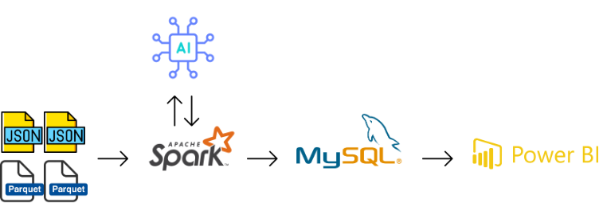
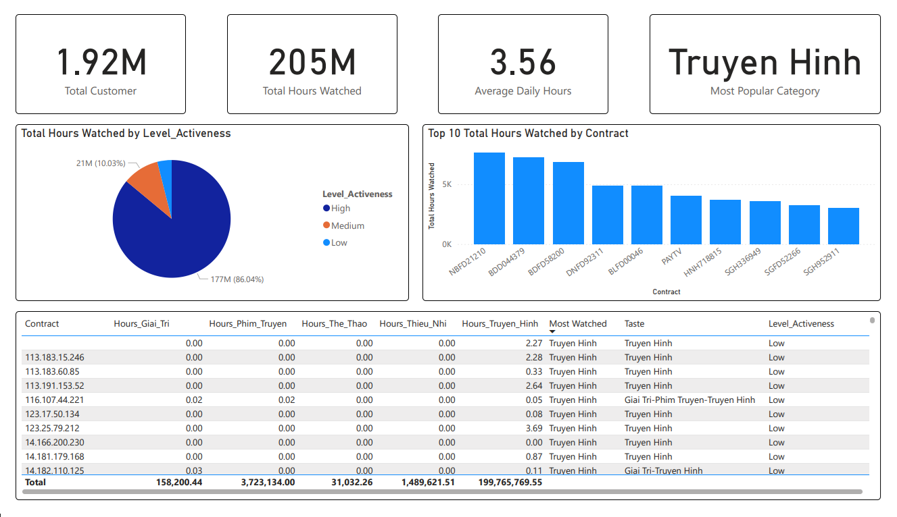
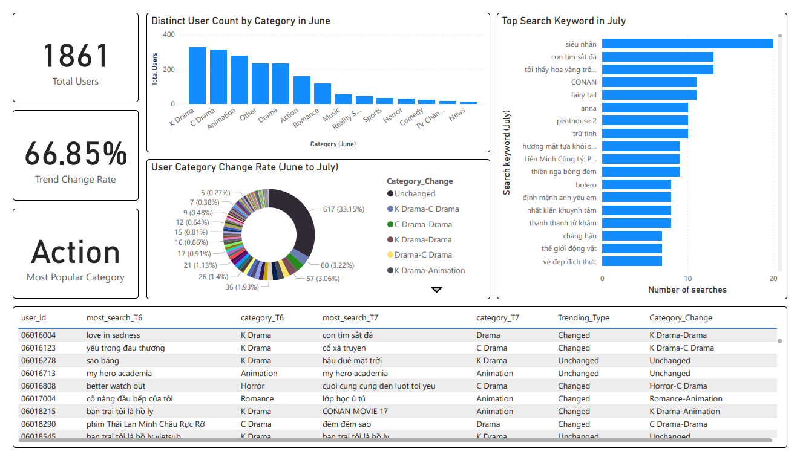

# 🚀 BigData ETL Pipeline for Customer360

This project demonstrates an **end-to-end ETL process** built with **Apache Spark** and augmented with an **AI Model (Gemini 2.5 Flash)** to handle and analyze comprehensive **Customer 360 data** (Interaction and Behavior). The final transformed data is loaded into a **MySQL** database as a data warehouse and visualized using **Power BI**.

---

## 📌 Project Overview

This project processes two main data sets to build a comprehensive view of the customer:

- **Interaction Data (30 JSON files)**: Captures user content viewing activities on the platform.
  - ✅ Built with **PySpark** to handle **large-scale JSON logs** efficiently.
  - ✅ Calculates key **user engagement metrics**: `Most_watched`, `Taste`, `Active` days, and `Level_Activeness` (High/Medium/Low).
- **Behavior Data (28 Parquet files)**: Records users' video search activities over two months (June-July).
  - ✅ Uses an **AI model (Gemini 2.5 Flash)** for automatic classification and enrichment of search terms into content categories.
  - ✅ Analyzes **content trend changes** between months (`Trending_Type`, `Category_Change`).

---

## 🛠️ Tech Stack

| Component | Description |
| :--- | :--- |
| **Apache Spark (PySpark)** | Fast, scalable distributed data processing and transformation for both JSON and Parquet files. |
| **Google Gemini 2.5 Flash** | Used for the **Behavior Data** ETL to classify and enrich user search keywords into defined content categories. |
| **MySQL** | Serves as the data warehouse to store and manage the final structured and transformed customer data. |
| **Power BI** | Used for data visualization and reporting to create dashboards and actionable insights. |
| **Pandas** | Used for date range handling and auxiliary logic within the PySpark environment. |

---

## 🗂️ Project Structure
BigData_ETL_Customer360/
├── etl_customer_interaction.py # ETL interaction data
├── etl_customer_behavior.py # # ETL behavior data
├── data/
│   ├── log_content_sample # Data for interaction (JSON file)
│   │   ├── 20220401.json 
│   │   ├── 20220402.json 
│   │   ├── ...
│   │   └── 20220430.json 
│   ├── log_search # Data for behavior (Parquet file)
│   │   ├── 20220601
│   │   ├── 20220602
│   │   ├── ...
│   │   └── 20220714
├── mysql-connector-j-8.0.33.jar
├── mysql-connector-net-9.5.0
├── README.md # Project Documentation
└── report.pdf # Project Report

---

## 🔄 ETL Flow

### 1. Extract

- **Interaction Data**: Reads **30 JSON files**, combining one month of user interactions.
- **Behavior Data**: Reads **28 Parquet files**, covering users' video search activity over two months.

### 2. Transform

| Dataset | Key Transformation Steps |
| :--- | :--- |
| **Interaction Data** | **1. Content Type Mapping**: Maps the `AppName` field to defined content types (e.g., `Truyen Hinh`, `Phim Truyen`, `Giai Tri`). **2. Pivot & Total Duration**: Reshapes the data and calculates `Total Duration` by pivoting on `Contract` and `Content Type`. **3. Metric Calculation**: Calculates `Most_watched`, `Taste`, `Active` days, and `Level_Activeness`. |
| **Behavior Data** | **1. Most Frequent Keyword**: Identifies the most frequently searched keyword for each user in each month (June & July). **2. AI Classification**: Uses the **AI model** to classify the most frequent search terms into content categories (`category_T6`, `category_T7`). **3. Trend Analysis**: Compares categories between months to determine `Trending_Type` (Changed/Unchanged) and `Category_Change` (e.g., 'K Drama-C Drama'). |

### 3. Load

- Appends the fully transformed and processed data to the respective tables (`interaction_data` and `behavior_data`) within the **MySQL** database.

---
## 📈 Data Schemas (MySQL Output)

### Interaction Data Schema (`interaction_data`)

| Column | Type | Description |
| :--- | :--- | :--- |
| `Contract` | `string` | Unique user identifier. |
| `Total_Giai_Tri` | `bigint` | Total duration of Entertainment content. |
| `Total_Phim_Truyen` | `bigint` | Total duration of Movie content. |
| `Total_The_Thao` | `bigint` | Total duration of Sports content. |
| `Total_Thieu_Nhi` | `bigint` | Total duration of Children content. |
| `Total_Truyen_Hinh` | `bigint` | Total duration of TV content. |
| `Most_watched` | `string` | Most-watched content type. |
| `Taste` | `string` | Genres the user interacted with. |
| `Active` | `bigint` | Number of days the user was active. |
| `Level_Activeness` | `string` | User engagement level (High / Medium / Low). |

##### Sample Output:
| Contract | Hours_Giai_Tri | Hours_Phim_Truyen | Hours_The_Thao | Hours_Thieu_Nhi | Hours_Truyen_Hinh | Most_Watched | Taste | Level_Activeness |
|:---|:---|:---|:---|:---|:---|:---|:---|:---|
| AGAAA0518 | 0.00 | 0.00 | 0.00 | 0.00 | 97.01 | Truyen Hinh | Truyen Hinh | Medium |
| AGAAA0520 | 0.00 | 0.12 | 0.00 | 0.00 | 48.18 | Truyen Hinh | Phim Truyên Hinh-Truyen Hinh | Medium |
| AGAAA0506 | 0.41 | 10.41 | 0.00 | 0.00 | 32.69 | Truyen Hinh | Giai Tri-Phim Truyên Hinh-Truyen Hinh | Medium |

### Behavior Data Schema (`behavior_data`)

| Column | Type | Description |
| :--- | :--- | :--- |
| `user_id` | `string` | Unique user identifier. |
| `most_search_T6` | `string` | User's most frequent search term in June. |
| `category_T6` | `string` | User's dominant content category in June. |
| `most_search_T7` | `string` | User's most frequent search term in July. |
| `category_T7` | `string` | User's dominant content category in July. |
| `Trending_Type` | `string` | Indicates if the dominant category **Changed** or was **Unchanged** between June and July. |
| `Category_Change` | `string` | Details the transition of the dominant category from June to July. |

##### Sample Output:
| user_id | most_search_T6 | category_T6 | most_search_T7 | category_T7 | Trending_Type | Category_Change |
|:---|:---|:---|:---|:---|:---|:---|
| 6016004 | love in sadness | K Drama | con tim sắt đá | Drama | Changed | K Drama-Drama |
| 6016123 | yêu trong đau thương | K Drama | cổ xà truyền | C Drama | Changed | K Drama-C Drama |
| 6016278 | sao băng | K Drama | hậu duệ mặt trời | K Drama | Unchanged | Unchanged |
---
## 📊 Power BI Dashboard
### Interaction Data Dashboard

### Behavior Data Dashboard

## 📞 Contact

* 👨‍💻 Author: Phan Anh Tuan
* 📧 Email: tuandte27@gmail.com
* 🐙 GitHub: [tuandte27](https://github.com/tuandte27)